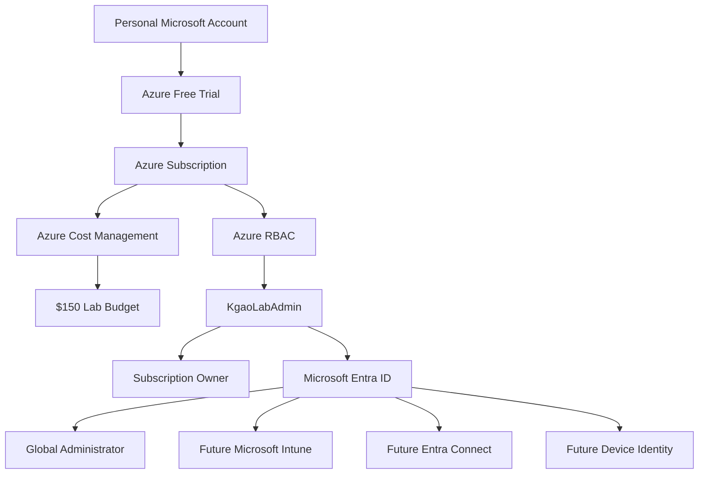

# 01 — Azure & Microsoft Entra Foundation

## Objective

The first phase of the lab establishes the **cloud foundation** required before integrating Microsoft Configuration Manager with Microsoft Intune.

The goals of this phase were to:

* Provision an Azure evaluation subscription
* Validate the Microsoft Entra tenant
* Create a dedicated lab administrator
* Configure Microsoft Entra administrative permissions
* Configure Azure RBAC permissions
* Resolve tenant and authentication issues
* Add Azure cost monitoring and budget controls
* Validate that the lab administrator can manage both identity and Azure resources

---

## Why This Phase Matters

Microsoft Configuration Manager is hosted inside the local Hyper-V lab, while services such as **Microsoft Intune, Microsoft Entra ID, Windows Autopilot, and Tenant Attach** operate in Microsoft's cloud.

The environment therefore needs both sides:

```text
ON-PREMISES LAB                         MICROSOFT CLOUD

Active Directory                       Microsoft Entra ID
       │                                      │
HYD-DC1                                      Users
       │                                      Devices
       │                                      Groups
HYD-CM1 ─────────────────────────────► Microsoft Intune
Configuration Manager                        │
       │                              Tenant Attach
Windows Clients                       Co-management
                                      Autopilot
```

This phase builds the cloud side before connecting it to the Configuration Manager environment.

---

# 1. Azure Free Trial Provisioning

## What is Azure?

Microsoft Azure provides the cloud infrastructure used by several Configuration Manager integration features.

Later phases of this project may use Azure for services such as:

* Cloud Management Gateway
* Resource groups
* Azure application registrations
* Cloud-connected Configuration Manager features

## Configuration

An **Azure Free Trial subscription** was activated for the lab.

The subscription provided promotional Azure credit for evaluation purposes.

```text
Subscription type: Azure Free Trial
Promotional credit: $200 USD
```

The environment was intentionally kept on the Free Trial rather than being upgraded to Pay-As-You-Go.

> **Important:** The lab is an evaluation environment. No production workloads are deployed into this subscription.

---

# 2. Existing Microsoft Entra Tenant Identified

## What is Microsoft Entra ID?

Microsoft Entra ID is Microsoft's cloud identity and access management platform.

It provides identities for:

* Users
* Administrators
* Devices
* Applications
* Microsoft Intune
* Microsoft 365
* Azure resources

The Microsoft lab documentation refers to this platform using its former name:

```text
Azure Active Directory / Azure AD
```

The current product name is:

```text
Microsoft Entra ID
```

---

## Tenant Discovery

After activating Azure, an existing Microsoft Entra directory was available.

```text
Directory: Default Directory
Primary domain: <LAB-DOMAIN>.onmicrosoft.com
License: Microsoft Entra ID Free
```

Because an Entra tenant already existed, there was no requirement to create an additional directory.

This avoided unnecessary complexity such as:

* Multiple tenants
* Incorrect subscription associations
* Authentication against the wrong directory
* Duplicate cloud identities

---

# 3. Dedicated Lab Administrator

A dedicated cloud administrator was created instead of performing the entire lab using the personal Microsoft account.

Example:

```text
KgaoLabAdmin@<LAB-DOMAIN>.onmicrosoft.com
```

For the public version of this repository, the actual tenant domain is intentionally excluded.

---

## Why Use a Dedicated Administrator?

Separating the lab administrator from the account that originally created the subscription provides a cleaner administrative model.

```text
Personal Microsoft Account
        │
        └── Subscription creation / billing owner

Dedicated Lab Administrator
        │
        ├── Microsoft Entra administration
        ├── Azure administration
        ├── Microsoft Intune administration
        └── Configuration Manager cloud integration
```

This also reduces dependence on a single identity if authentication problems occur.

---

# 4. Microsoft Entra Global Administrator

The dedicated lab administrator was assigned:

```text
Role: Global Administrator
```

## What Does Global Administrator Mean?

The **Global Administrator** role provides extensive administrative control over Microsoft Entra ID and Microsoft cloud services.

It can manage areas including:

* Users
* Groups
* Administrative roles
* Enterprise applications
* Device identity
* Tenant configuration
* Microsoft Intune prerequisites

However, an important lesson from this lab was that:

> **Microsoft Entra roles and Azure resource permissions are separate permission systems.**

A Global Administrator does **not automatically become an Azure subscription Owner**.

---

# 5. Issue — AADSTS50020 Authentication Failure

## Symptom

During authentication with the newly created lab administrator, sign-in failed with an error similar to:

```text
AADSTS50020

User account does not exist in tenant 'Microsoft Services'
and cannot access the application in that tenant.
```

---

## Investigation

The dedicated administrator had already been successfully created inside the lab's Microsoft Entra tenant.

The error referenced a different tenant:

```text
Microsoft Services
```

rather than the lab's:

```text
Default Directory
```

This indicated that the account itself was not necessarily invalid.

The authentication request was occurring in the wrong tenant context.

---

## Root Cause

The browser authentication session was attempting to access a resource associated with a different Microsoft tenant.

Conceptually:

```text
Valid Cloud Account
        +
Incorrect Tenant Context
        =
AADSTS50020
```

---

## Resolution

The authentication session was returned to the correct Microsoft Entra directory and the dedicated administrator was used against the intended lab tenant.

No guest account was required.

---

## Lesson Learned

When troubleshooting `AADSTS50020`, verify:

```text
Current directory
Tenant context
User Principal Name
Identity provider
Target application/resource
```

before recreating accounts or adding users as external guests.

---

# 6. Issue — MFA / Security Registration Loop

## Symptom

The original subscription account repeatedly displayed:

```text
Let's keep your account secure

We'll help you set up another way to verify it's you.
```

The security registration page remained in a loading state.

---

## Troubleshooting Attempted

The sign-in process was tested using:

* Another browser
* Private / Incognito browsing
* New authentication sessions

The behavior continued.

---

## Operational Decision

Rather than allowing the MFA registration problem on the original account to block the entire lab deployment, the dedicated `KgaoLabAdmin` account was used for administrative recovery.

This demonstrated the value of maintaining more than one authorized administrative identity in a test environment.

---

# 7. Issue — Azure Credit / Subscription Not Visible

## Symptom

After successfully signing into Azure using the new lab administrator, the Azure portal displayed:

```text
We couldn't load your credit info
```

The Azure Free Trial subscription information was not initially visible to the account.

---

## Root Cause

The account had:

```text
Microsoft Entra:
Global Administrator
```

but did not yet have Azure RBAC permission over the subscription.

This exposed an important architectural distinction.

### Microsoft Entra Roles

Control administration of the identity directory.

Examples:

```text
Global Administrator
User Administrator
Intune Administrator
```

### Azure RBAC Roles

Control access to Azure resources.

Examples:

```text
Owner
Contributor
Reader
User Access Administrator
```

These two authorization systems are related but independent.

---

# 8. Temporary Azure Access Elevation

Because the dedicated account was already a Global Administrator, temporary Azure access elevation was enabled.

Navigation:

```text
Microsoft Entra ID
        ↓
Overview
        ↓
Properties
        ↓
Access management for Azure resources
```

The setting was changed:

```text
No
↓
Yes
```

---

## What Did This Do?

Enabling this option temporarily allowed the Global Administrator to manage Azure access across subscriptions associated with the tenant.

The account received:

```text
Role: User Access Administrator
Scope: Root
```

This was visible in Azure as an inherited privileged role.

---

## Why Was This Necessary?

The lab administrator needed enough access to assign itself a permanent Azure role at the subscription level.

The temporary elevation was therefore used only as a recovery mechanism.

---

# 9. Azure Subscription Became Accessible

After refreshing the authentication session, the lab administrator could successfully access:

```text
Azure subscription 1
```

The Azure promotional credit information also became visible.

This confirmed that the problem was authorization-related rather than a subscription provisioning failure.

---

# 10. Azure Subscription Owner Assignment

The dedicated administrator was assigned the Azure RBAC role:

```text
Owner
```

at the subscription scope.

Navigation:

```text
Azure Portal
        ↓
Subscriptions
        ↓
Azure subscription
        ↓
Access control (IAM)
        ↓
Add role assignment
        ↓
Owner
```

The lab administrator was selected as the role member.

---

## Final Permission Model

The dedicated lab administrator now has two important permissions:

| Platform           | Permission           |
| ------------------ | -------------------- |
| Microsoft Entra ID | Global Administrator |
| Azure Subscription | Owner                |

This provides the permissions required for later cloud-integration exercises.

---

# 11. Remove Temporary Root Elevation

The root-level `User Access Administrator` permission was only required temporarily.

After the permanent subscription Owner assignment was validated, the elevation was removed.

Navigation:

```text
Microsoft Entra ID
        ↓
Overview
        ↓
Properties
        ↓
Access management for Azure resources
```

Changed:

```text
Yes
↓
No
```

---

## Final Security State

```text
Global Administrator              ✅
Azure Subscription Owner          ✅
Root User Access Administrator    ❌ Removed
```

This follows the principle of removing unnecessary elevated access after completing an administrative recovery task.

---

# 12. Azure Cost Protection

Before deploying Azure resources, cost monitoring was configured.

This was important because later lab exercises can create chargeable Azure resources.

Examples can include:

* Cloud Management Gateway resources
* Storage
* Networking
* Public IP addresses
* Compute services

---

# 13. Azure Budget

An Azure Cost Management budget was created.

```text
Budget name: IntuneLabBudget
Budget amount: $150 USD
Reset period: Monthly
Scope: Lab Azure subscription
```

The $150 budget was intentionally configured below the available $200 promotional credit.

This provides an early-warning buffer before the full evaluation credit is consumed.

---

## Suggested Alert Strategy

| Threshold | Approximate Cost |
| --------: | ---------------: |
|       50% |              $75 |
|       75% |          $112.50 |
|       90% |             $135 |
|      100% |             $150 |

Email notification was configured for budget alerts.

---

## Important Budget Concept

An Azure budget is primarily:

```text
Monitoring + Notification
```

It should not be considered an instantaneous hard shutdown mechanism.

The Free Trial spending limit provides an additional safeguard for this evaluation environment.

---

# 14. Issue — Budget Notification Email Validation

## Symptom

The Azure budget wizard initially refused to accept the notification email address.

## Troubleshooting

The recipient field was cleared and the address was re-entered.

## Resolution

The email recipient was successfully accepted and the budget was created.

## Validation

The Azure portal displayed:

```text
IntuneLabBudget
Monthly
$150.00
```

Status:

```text
Azure budget configuration: SUCCESS
```

---

# 15. Final Cloud Foundation Architecture



---

# 16. Validation Checklist

At the completion of this phase:

| Validation                                | Result |
| ----------------------------------------- | ------ |
| Azure subscription available              | ✅      |
| Azure promotional credit available        | ✅      |
| Microsoft Entra tenant available          | ✅      |
| Dedicated lab administrator created       | ✅      |
| Global Administrator assigned             | ✅      |
| Subscription Owner assigned               | ✅      |
| Subscription visible to lab administrator | ✅      |
| Temporary elevation removed               | ✅      |
| Azure budget configured                   | ✅      |
| Budget notification configured            | ✅      |

---

# 17. Key Lessons Learned

### Entra Administration Is Not Azure Administration

A Microsoft Entra **Global Administrator** does not automatically have full access to Azure subscriptions.

Azure resources use **Azure RBAC**.

---

### Tenant Context Matters

Authentication failures such as `AADSTS50020` can occur even when an account exists correctly if the authentication request is targeting the wrong tenant.

---

### Temporary Elevation Should Remain Temporary

The Global Administrator elevation capability was useful for recovering Azure subscription access, but the root permission was removed once a permanent subscription-level Owner role was established.

---

### Cost Controls Should Be Configured Early

Cost monitoring was implemented before deploying chargeable cloud resources.

This reduces the risk of accidentally exhausting evaluation credit while learning.

---

### Separate Administrative Identities Improve Recoverability

The dedicated cloud administrator allowed lab work to continue even while the original account experienced MFA/security-registration problems.

---

# 18. Security Considerations

This repository is public.

The following information has intentionally been excluded or sanitized:

```text
Actual tenant domain
Tenant ID
Subscription ID
Personal email address
Passwords
Temporary passwords
Authentication tokens
Payment information
Application secrets
Certificate private keys
```

Placeholders are used instead:

```text
<LAB-DOMAIN>
<TENANT-ID>
<SUBSCRIPTION-ID>
<LAB-ADMIN-UPN>
```

---

# 19. Phase Result

```text
AZURE & MICROSOFT ENTRA FOUNDATION
STATUS: COMPLETE ✅
```

The lab now has a functioning cloud identity and Azure administration foundation.

The environment is ready to proceed with:

```text
Microsoft 365
        ↓
Microsoft Intune
        ↓
Microsoft Entra Connect
        ↓
Hybrid Identity
        ↓
Configuration Manager Cloud Integration
        ↓
Tenant Attach / Co-management
```

---


